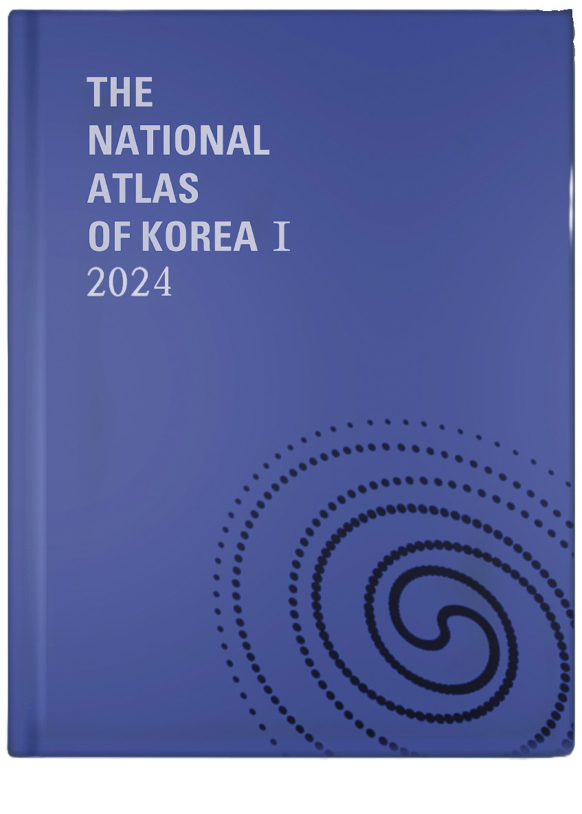

::: {.page-banner}
{.page-banner-img alt="projects"}
:::

## 2026

<strong>Micro-Degree Winter Professional Development Program</strong>
 · 2026

Participated in a collaborative winter professional development program jointly organized by the Seoul National University Learning Sciences Institute and the Seoul Metropolitan Office of Education. The program focused on designing and developing interactive dashboards that can be directly implemented in classroom instruction.

Organized by: Seoul National University Learning Sciences Institute (서울대학교 학습과학연구소)  
Seoul Metropolitan Office of Education (서울특별시교육청)

## 2025

<strong>The National Atlas of Korea</strong>
 · 2024–2025

Participated in the development of interactive web-based atlas content for <em>The National Atlas of Korea</em>.
Responsible for building interactive thematic maps and user-driven map interaction components, and for preparing national-scale geospatial data for web deployment.

Organized by: National Geographic Information Institute (국토지리정보원)

## 2024

<strong>The National Atlas of Korea</strong>
 · 2024–2025

Participated in the development of interactive web-based atlas content for <em>The National Atlas of Korea</em>.
Responsible for building interactive thematic maps and user-driven map interaction components, and for preparing national-scale geospatial data for web deployment.

Organized by: National Geographic Information Institute (국토지리정보원)

