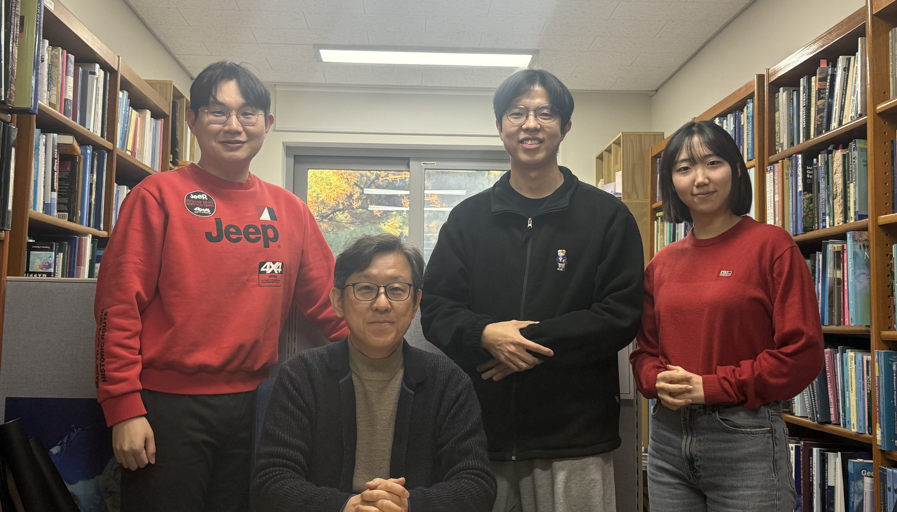

---
<<<<<<< HEAD
title: "Team"
title-block: false
=======
title: " "
>>>>>>> c9c25136c8f36683ccdd3e83f1391a74a10a43f1
toc: false
page-layout: full
---

::: {.team-hero-card}
{.team-hero-img alt="단체사진"}
:::

## Professor

::: {.professor-layout}

  

### Sang-Il Lee

**Office**: [Room 319, Building 10, College of Education, Seoul National University](https://www.google.com/maps?q=37.460373,126.955093)

🎓 Ph.D. in Geography, The Ohio State University  
🎓 M.A. in Geography Education, Seoul National University  
🎓 B.A. in Geography Education, Seoul National University  

#### 📖 Research Interests
- Spatial Data Science  
- Spatial Data Analysis and Spatial Statistics  
- Cartography and GeoVisualization  
- Geographic Information Systems (GIS)  
- Population Geography and Spatial Demography  
- Geography of Education  

  

  

:::

## Master Students

<h3>Hyekyeong Nam</h3>

M.A. Student

Spatial Data Science

<h3>Woohyung Kim</h3>

M.A. Student

Spatial Data Science
GeoAI

<h3>Minseop Jeong</h3>

M.A. Student

Population Geography

<h3>Seowoo Park</h3>

M.A. Student

Spatial Data Science
Remote sensing

<<<<<<< HEAD

<h3>Sori Yun</h3>

M.A. Student

Spatial Data Science

<h3>Dai Yifan</h3>

M.A. Student

GIS
Machine Learning

=======
>>>>>>> c9c25136c8f36683ccdd3e83f1391a74a10a43f1

## Alumni

### Recent Graduates

- **Hyemin Jeon (M.A., 2025)**
- **Sechang Kim (M.A., 2023)**: Ph.D. Student at University of Washington

## Join Our Lab

If you are interested in joining our lab, please feel free to contact us!

**Contact**: [si_lee@snu.ac.kr](mailto:si_lee@snu.ac.kr)
